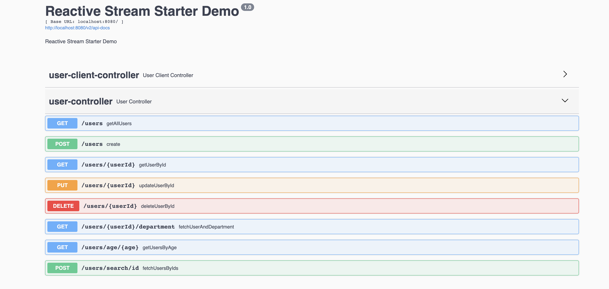

# Sample Reactive - Spring Boot application

The purpose of this project is to demonstrate how we can
use [Spring WebFlux](https://docs.spring.io/spring/docs/current/spring-framework-reference/web-reactive.html) to create
a simple reactive web application.

This project uses [PostgreSQL](https://github.com/r2dbc/r2dbc-postgresql) implementation of the R2DBC SPI.

# How to build and run

project can be compiled with JDK 8 and above `javac`.

To compile just do `mvn clean package`.

## Prerequisites

* JAVA 8 should be installed
* Postgres should be up and running at : <localhost:5432>

To run the application execute the following:

```
java -jar target/reactive-examples*.jar
```

You can also use the Swagger-UI to test the application.


for more detailed technical information please check my
post : <https://dassum.medium.com/building-a-reactive-restful-web-service-using-spring-boot-and-postgres-c8e157dbc81d>

The server will start at <http://localhost:8080>.

## Exploring the Rest APIs

The Swagger UI will open at : <http://localhost:8080/swagger-ui/index.html>

The application contains the following REST APIs

```
1. GET /users - Get All Users

2. POST /users - To create a User

3. GET /users/{userId} - Retrieve an User by Id

3. PUT /users/{userId} - Update an User

4. DELETE /users/{userId} - Delete an User

4. GET /users/events - Stream users to a browser as Server-Sent Events
```

It contain a sample WebClient to retrieve data from our User Management application.

## Run postgres with docker compose
```
#In the docker compose we create the db, and set the user and password used later in the application.yml file
docker-compose up -d
docker-compose down
#when you change configurations remember in case to remove also the pv
docker volume ls
#remove all unused volumes
docker volume prune
```

### Example postgres commands
```
GUI: pgAdmin
CLI commands:
psql -h <REMOTE HOST> -p <REMOTE PORT> -U <DB_USER> <DB_NAME>
psql -h 127.0.0.1 -p 5432 -U test_user test
#list all databases
/l
#connect to a certain database
\c <db name>
#list all tables in the current database using your search_path
\dt
#list all tables in the current database regardless your search_path
\dt * 
#queries as usual
select * from department;
INSERT INTO table_name(column1, column2, …) VALUES (value1, value2, …);
```